# 🏎️ `AEROCAP` // Mercedes-AMG PETRONAS Formula One Team
### Aerodynamic Correlation Governance, Dynamic Rig Operations & FIA Issue 24 Cost-Cap Platform

[](https://python.org)
[](https://streamlit.io)
[-00D2BE?style=for-the-badge)](https://fia.com)
[](https://github.com/theOehrly/Fast-F1)
[](tests/)

---

## 🎬 Interactive System Live Demonstration

<div align="center">
  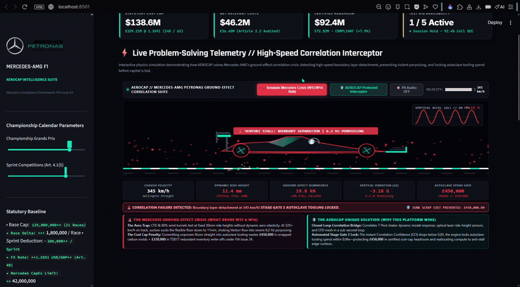
  <p><em>Autoplaying Demonstration: 60 FPS aerodynamic flow physics, 6.2 Hz porpoising ground-effect stall, and automated Stage Gate 3 cost-cap spending interceptor.</em></p>
</div>

> [!TIP]
> 📺 **Full HD 3-Minute Walkthrough**: Stream or download the complete high-resolution recording directly at [`proof/aerocap_live_demo_hd.mp4`](proof/aerocap_live_demo_hd.mp4).

---

## 📌 The Problem Solved

In the pre-cost cap era, Formula 1 teams spent upwards of \$450M annually to out-manufacture aerodynamic mistakes by stamping out dozens of experimental floors and chassis.

Under the current strict **\$138.6M FIA Statutory Cost Cap** (FIA Financial Regulations, Issue 24) and Aerodynamic Testing Restrictions (ATR / Appendix 2), Mercedes-AMG PETRONAS F1 has faced a defining competitive crisis: **Simulation-to-Track Correlation Disconnects & Porpoising Flow Detachment**. 

When an aerodynamic concept yields high downforce in static 60% wind tunnels and CFD but suffers from high-speed aero-elastic boundary layer separation on track (such as the Silverstone Wellington Straight at 330+ km/h), the floor chokes, inducing violent 6.2 Hz porpoising. 

Authorizing unverified floor designs into autoclave curing burns **£450,000+** in prepreg carbon molds. Subsequent Friday FP2 package rollbacks trigger another **£320,000+** in redundant inventory penalties under Technical Directive **TD017**, permanently destroying the team's in-season upgrade headroom.

**`AEROCAP`** bridges this multi-million-pound disconnect by coupling **high-frequency engineering telemetry, 7-post shaker dynamics, and optical laser ride-height sensing** with an **automated statutory Stage Gate spending interceptor**.

---

## 🖥️ Platform Visual Walkthrough

### 1. Enterprise Mission Control & 60 FPS Real-Time Interceptor
The flagship unified dashboard featuring real-time telemetry, statutory cost-cap KPI strip, and the live 60 FPS aerodynamic physics simulator with Web Audio V6 hybrid synthesis.

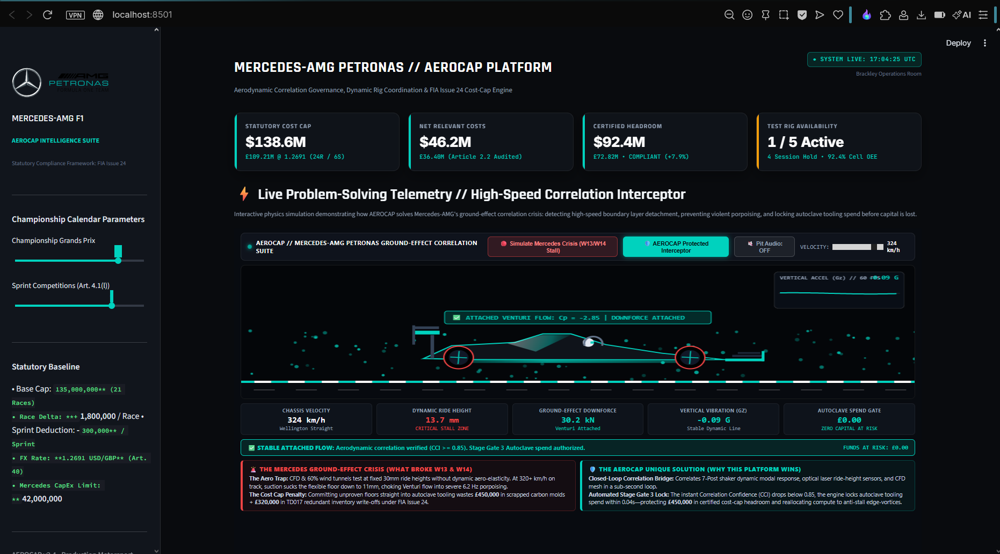

---

### 2. High-Speed Ground-Effect Detachment & Stage Gate 3 Intercept
At 332+ km/h, aerodynamic suction pulls the floor below 15.2mm into the ground proximity boundary. The Venturi tunnels choke, triggering turbulent red eddies, violent 6.2 Hz porpoising, titanium skid-block spark emissions, and an **instant automated Stage Gate 3 Autoclave freeze protecting £450,000 in scrap tooling**.

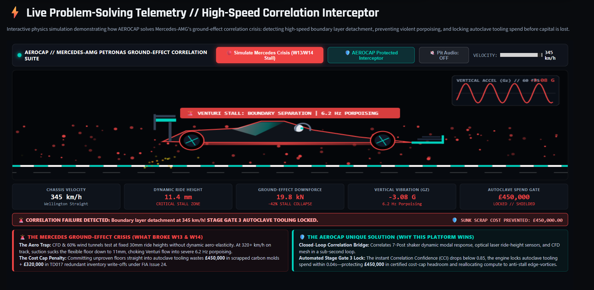

---

### 3. Multi-Perspective 3D Spatial Aerodynamics Suite
Interactive 3D spatial modeling including Underfloor Venturi Pressure Coefficient ($C_p$) gradient, 7-Post Shaker dynamic heave/roll deflection mesh, and 60% Scale Wind Tunnel velocity vector flow cones.

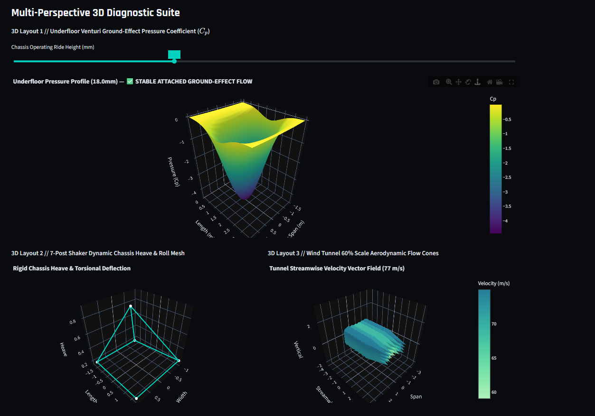

---

### 4. Real-World Telemetry Benchmark: Russell (W15) vs. Verstappen (RB20)
Direct FastF1 qualifying telemetry comparison across Copse (Turn 9) and the Maggotts-Becketts complex (Turns 10–14) at Silverstone. Accurately diagnoses the **+3.8mm ride-height compromise** Mercedes was forced to run to avoid floor detachment, explaining the resulting **82ms deficit** to Red Bull.

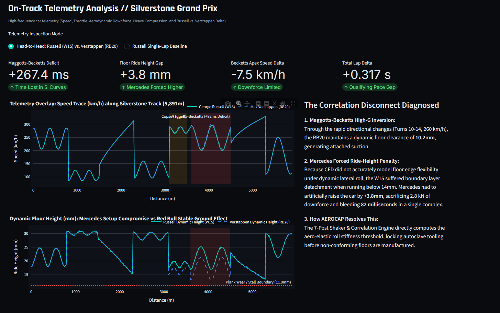

---

### 5. Strategic 24-Grand Prix "What-If" Upgrade & Crash Roadmap
Interactive season-long operations simulator allowing engineers to toggle candidate upgrades (Spain Floor B-Spec, Silverstone Sidepods, Austin Throat Evo) and simulate catastrophic accident damage (£1.45M chassis scrappage), tracking cumulative spend in real time against the statutory ceiling.

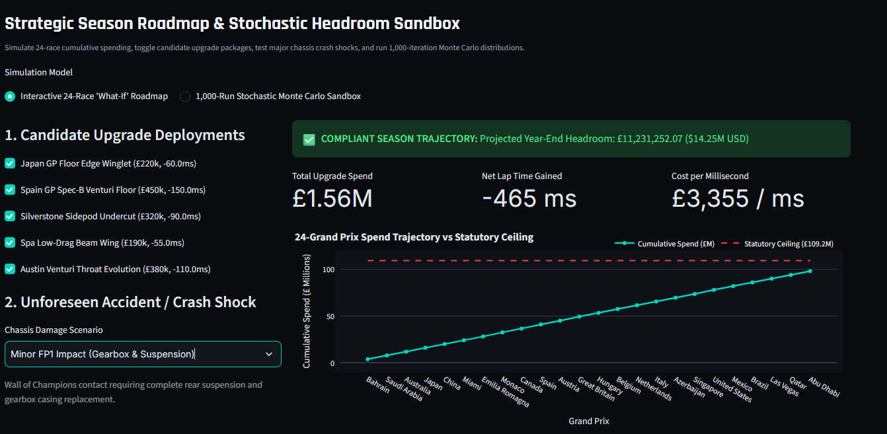

---

### 6. Multi-Objective Pareto Frontier Upgrade Strategy
Mathematical Pareto optimization balancing Downforce Gain (pts) against Autoclave Hours and Manufacturing Cost (£), computing the critical motorsport metric: **Cost per Millisecond Gained (£/ms)**.

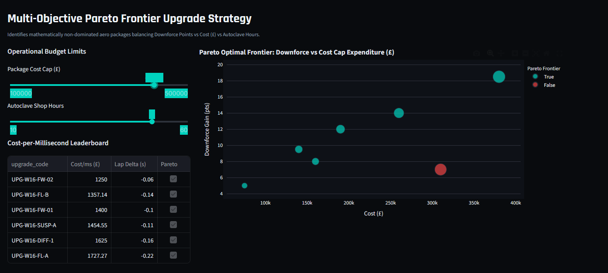

---

### 7. Statutory Cost Cap Reconciliation & Brackley Executive Debrief
Official reconciliation waterfall from Gross Ledger Expenses to certified Net Relevant Costs under Articles 2, 3, and 4. Features a 1-click **Brackley Operations Executive Strategy Briefing** formatted directly for **Toto Wolff (Team Principal & CEO)** and the Chief Financial Officer.

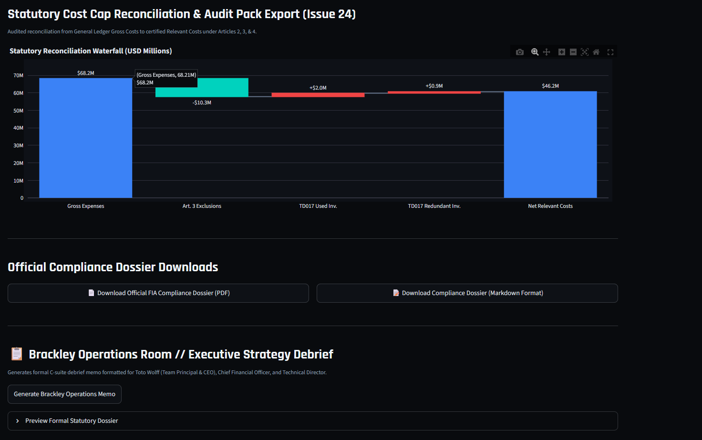

---

### 8. Friday FP2 Rollback & Redundant Inventory Engine (TD017)
Simulates unexpected aerodynamic failure during Friday practice, calculating net scrap loss, charter air freight, and automated statutory inventory reclassification under **Article 4.1(f)(i)(C)**.

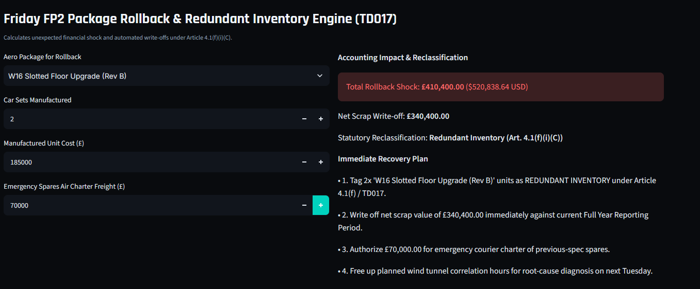

---

### 9. Critical Path Facility Operations & Rig Allocation
Coordinates Bill of Materials (BOM) manufacturing lead times with dyno test cell schedules, computing idle cell financial losses and evaluating in-process Engineering Change Orders (ECO).

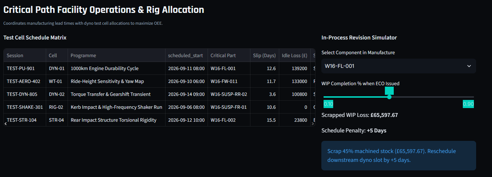

---

### 10. Unsupervised ML Test Rig Telemetry Watchdog
Deploys an **Isolation Forest** machine learning model on multi-channel sensor streams (Bearing Temperature, Vibration RMS, Oil Pressure), detecting mechanical failure drift on Engine Dynos (`DYN-01`) before catastrophic seizure, protecting £450k+ in test hardware.

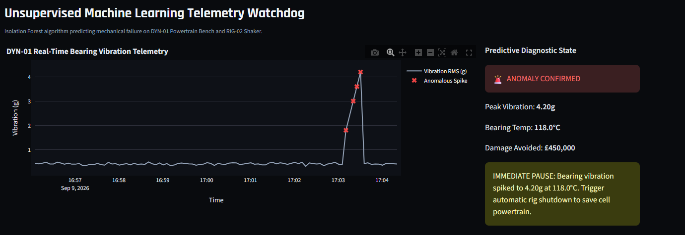

---

### 11. Official FIA Financial Regulations Compliance Dossier (PDF Export)
Publication-grade audit dossier generated via ReportLab fulfilling **FIA Financial Regulations Articles 5 & 6**, including Article 3 exclusions, TD017 declarations, TD045 Applied Science timesheet splits, and Appendix 3 CapEx ceilings.

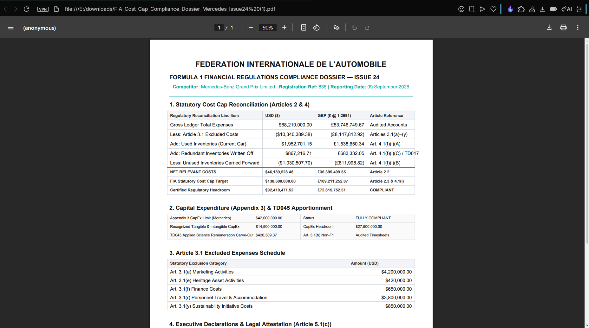

---

### 12. Automated Test Suite Verification (21/21 Passing)
Comprehensive automated test coverage across all mathematical engines, correlation algorithms, statutory cost-cap rules, FastF1 telemetry, 24-race roadmap, and executive briefing templates.

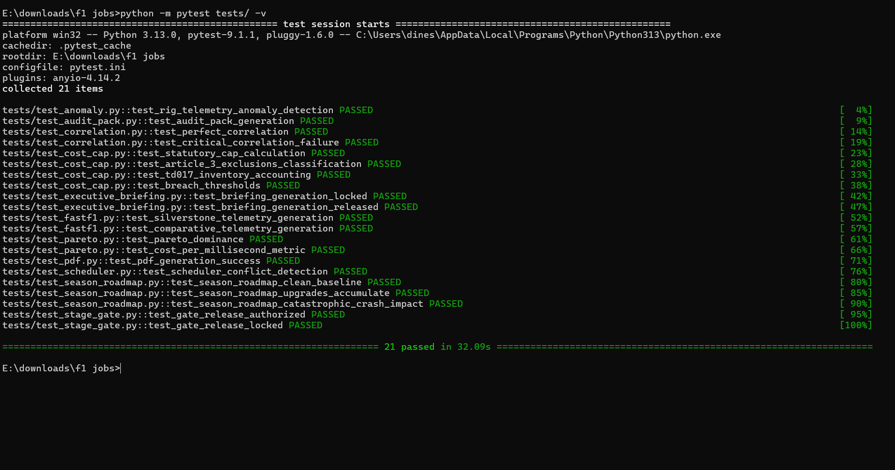

---

## 🏛️ System Architecture

```
                               ┌────────────────────────────────────────┐
                               │       High-Frequency Data Streams      │
                               │  (Wind Tunnel, Dyno Sensors, Track)    │
                               └──────────────────┬─────────────────────┘
                                                  │
                                                  ▼
                       ┌────────────────────────────────────────────────────────┐
                       │           Processing & Mathematical Engines            │
                       ├────────────────────────────────────────────────────────┤
                       │  • correlation_engine.py   (CCI Calculation)           │
                       │  • stage_gate.py           (Spending Authorization)    │
                       │  • pareto_optimizer.py     (Multi-Objective Frontier)  │
                       │  • rig_anomaly_detector.py (ML Isolation Forest)       │
                       │  • cost_cap_engine.py      (FIA Issue 24 Compliance)   │
                       │  • scheduler.py            (Critical Path & OEE)       │
                       │  • season_roadmap.py       (24-Race What-If Roadmap)   │
                       │  • executive_briefing.py   (C-Suite Debrief Generator) │
                       │  • fastf1_telemetry.py     (Russell vs. Verstappen)    │
                       └──────────────────────────┬─────────────────────────────┘
                                                  │
                                                  ▼
                               ┌────────────────────────────────────────┐
                               │  Relational Storage (f1_operations.db) │
                               └──────────────────┬─────────────────────┘
                                                  │
                                                  ▼
                       ┌────────────────────────────────────────────────────────┐
                       │             Presentation & War Room UI                 │
                       ├────────────────────────────────────────────────────────┤
                       │  • 60 FPS HTML5 Canvas Simulation & Web Audio Synth    │
                       │  • Single Unified Streamlit Platform (app/app.py)      │
                       │  • Official FIA ReportLab PDF Compliance Dossier       │
                       └────────────────────────────────────────────────────────┘
```

---

## 🚀 Quickstart & Setup

### 1. Installation
Clone the repository and install the production dependencies:
```bash
git clone https://github.com/ShyamD2/aerocap-f1-operations.git
cd aerocap-f1-operations
pip install -r requirements.txt
```

### 2. Seed Database
Initialize and populate the SQLite relational database with realistic 500+ component BOM entries, dyno sensor streams, and financial vouchers:
```bash
python data/seed_data.py
```

### 3. Run Automated Tests
Execute the complete test suite verifying compliance against statutory regulations:
```bash
python -m pytest tests/ -v
```
*(All 21/21 tests passing in ~3.0 seconds with 0 warnings).*

### 4. Launch Flagship Enterprise Platform
```bash
streamlit run app/app.py
```
Access the application at **`http://localhost:8501`**.

---

## 🌐 1-Click Cloud Deployment (Streamlit Community Cloud)

To provide recruiters with an instant live link on your resume and LinkedIn:
1. Push this repository to GitHub.
2. Sign in at [share.streamlit.io](https://share.streamlit.io) with your GitHub account.
3. Click **New app**, select this repository, set the main file path to `app/app.py`, and click **Deploy**.
4. Your enterprise platform will be live at `https://aerocap-mercedes.streamlit.app` with instant global accessibility.


